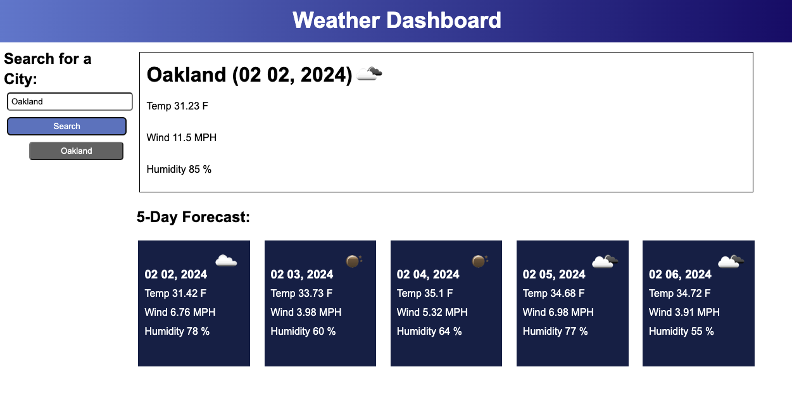
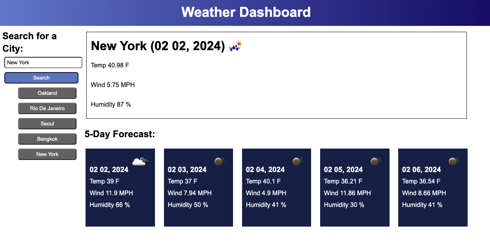
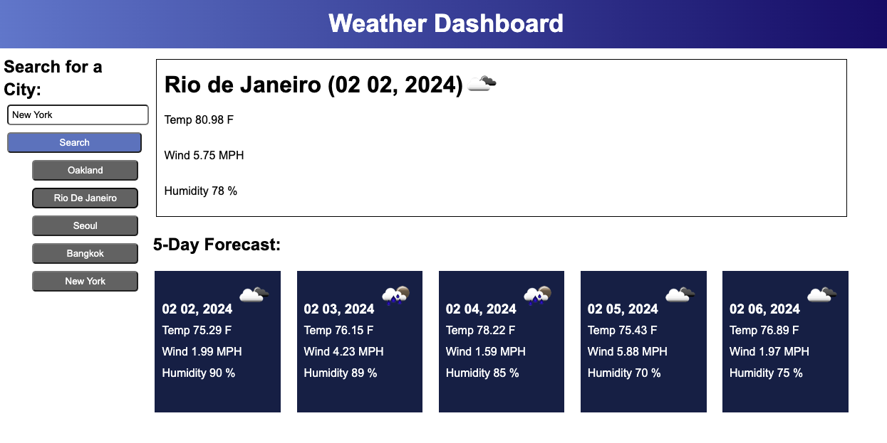

# Challenge 6: How's The Weather?

A weather app that uses a third part API: openweathermap

The purpose of this project was to create a weather dashboard app that displays the current weather and a five-day forecast. To display the weather, I needed to use the OpenWeatherMap Application Programming Interface (API).

---

Images of the weather dashboard app below:

Image shows: Initial seach of "Oakland". Weather and five-day forecast is displayed and "Oakland" is saved as a previously searched city in the aside.

Image shows: More cities are searched. The accumulation of searched cities are saved in the aside as previously searched cities.

Image shows: The previously searched city "Rio de Janeiro" is clicked on in the aside and its weather and five-day forecast is disaplyed again.

---

**Table of contents**

- [Motivation](#item-one)
- [What are the problems identified?](#item-two)
- [What are the solutions?](#item-three)
- [What was learned?](#item-four)
- [Usage](#item-five)
- [Credits](#item-six)
- [License](#item-seven)

---

### MOTIVATION

My motivation for making the weather dashboard app was to learn how to use an API. I wanted to learn how to take the data from an API call and implement parts of it into a website/app that I created using HTML, CSS, and JS.

### WHAT ARE THE PROBLEMS IDENTIFIED?

For my challenge I started from scratch and created my own HTML, CSS, and JS. My main problems identified were determining what to use to create the layout and dynamic display functions of my weather dashboard app, and how to call an API to get data and display that data in my app. Below are more specific problems I identified to break down my problem-solving process.

- When creating the structure of the app, what should be created in HTML and what should be created in JavaScript?
- How do I sign up for an API key?
- How do I set up the API key and API URL in my JS so that I can fetch the data?
- How do I display data from the API that I need in my app?

### WHAT ARE THE SOLUTIONS?

- Solution to determing whether I should use HTML or JavaScript to create the structure of the app: After looking at the model we were given to base or weather app from, and after reading the acceptance criteria, it became clear that I should have content that was static be created with HTML - this included the header, the aside container, and the weather container. Because the five forecast cards would change and therefore by dynamic, I felt that this content should be created with JavaScript.
- Solution to signing up for the API key: I navigated to the openweathermap website, signed up for a username, and copied the API key needed.
- Solution to settign up the API key and API URL in my JS: I took some time to read through the documentation and realized that I would need to make multiple fetch requests: 1. the initial fetch request to get the current weather when the user typed in a city name and clicked the search button, 2. another fetch request to get the five-day forecast when that initial search button was clicked, and 3. fetching both the weather and five-day forecast again when a city that was previously searched was clicked on by the user again. I therefore arranged my JS in a way that put the first two fetch requests inside of a function that could be called. I passed in either a user typed city search (the user's initial city search) or the city the user already searched previously (the city buttons displayed on the aside column of previously searched cities) to make the fetch requests.
- Solution to displaying data from the API in my app: I read the documentation on the openweathermap website and determined the necessary parameters to get the information I wanted to display in my app. Once this was determined, I coded these parameters into my JS to get the necessary data to display.
  

### WHAT WAS LEARNED?

I continued to learn how to use HTML, CSS, and JS to structure, design, and give functionality to a website/app. I learned what is involved in using an API to get data to display in a website/app.

### USAGE

The deployed page through GitHub can be found at the following [link](https://alexahnbaum.github.io/Challenge_6_How-s_The_Weather-/)

### CREDITS

During the course of this challenge, I reviewed class content, went to office hours to get advice/guidance from my boot camp professor, John Young, and worked with a tutor from my boot camp, Meg Meyers.

### LICENSE

MIT License

Copyright (c) 2023 alexahnbaum

Permission is hereby granted, free of charge, to any person obtaining a copy
of this software and associated documentation files (the "Software"), to deal
in the Software without restriction, including without limitation the rights
to use, copy, modify, merge, publish, distribute, sublicense, and/or sell
copies of the Software, and to permit persons to whom the Software is
furnished to do so, subject to the following conditions:

The above copyright notice and this permission notice shall be included in all
copies or substantial portions of the Software.

THE SOFTWARE IS PROVIDED "AS IS", WITHOUT WARRANTY OF ANY KIND, EXPRESS OR
IMPLIED, INCLUDING BUT NOT LIMITED TO THE WARRANTIES OF MERCHANTABILITY,
FITNESS FOR A PARTICULAR PURPOSE AND NONINFRINGEMENT. IN NO EVENT SHALL THE
AUTHORS OR COPYRIGHT HOLDERS BE LIABLE FOR ANY CLAIM, DAMAGES OR OTHER
LIABILITY, WHETHER IN AN ACTION OF CONTRACT, TORT OR OTHERWISE, ARISING FROM,
OUT OF OR IN CONNECTION WITH THE SOFTWARE OR THE USE OR OTHER DEALINGS IN THE
SOFTWARE.
